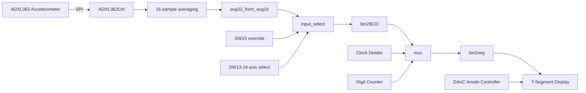

# FPGA Accelerometer Monitor

A real-time FPGA-based sensor processing system implemented in VHDL on the Nexys-A7 (XC7A100T). The design interfaces with an ADXL362 accelerometer over SPI, performs hardware-based signal averaging, and displays signed decimal acceleration values via a multiplexed 7-segment driver.

The system demonstrates end-to-end embedded datapath design: sensor interfacing, real-time processing, format conversion, and hardware display control.

---

## System Architecture



---

## Performance & Timing

| Parameter | Value |
|-----------|-------|
| System clock | 100 MHz |
| SPI clock | 1 MHz |
| Accelerometer update rate | ~100 Hz |
| Display refresh rate | 250 Hz (4ms per digit scan cycle) |
| Total latency (sensor to display) | ~10-20 ms (1-2 update cycles) |

## FPGA Resource Utilisation (post-synthesis)

| Resource | Usage |
|----------|-------|
| LUTs | 280 |
| Flip-flops | 380 |
| BRAM | 0 |
| DSP | 0 |

---

## Engineering Challenges

**SPI timing reliability**
Ensured correct CPOL/CPHA alignment and stable MISO sampling at rising clock edges. Used handshake-based Start/Done signalling to cleanly sequence multi-byte transactions without race conditions.

**Noise in accelerometer readings**
Raw readings from the ADXL362 contain significant sample-to-sample noise. Addressed using a two-stage 32-sample averaging pipeline: the controller computes an internal 16-sample average, which is then averaged with the previous 16-sample result to produce a stable 32-sample output. Overflow-safe 13-bit signed arithmetic used throughout.

**Signed decimal display**
Displaying two's complement values on a decimal display requires full sign handling. Implemented using the Double Dabble algorithm extended to 12-bit signed inputs: detects the sign bit, negates if necessary, then iterates 12 shift cycles with conditional add-3 on each BCD column. Sign digit handled as a separate output without increasing datapath width.

**Multiplexed display flicker**
A naively clocked scanning display produces visible flicker. Solved by driving the digit scan at 250 Hz using a clock divider counting 400,000 cycles of the 100 MHz system clock, cycling through 5 digits at 4ms per digit. Below the threshold of perceptible flicker.

---

## Components

### `display.vhd` - Top-Level Module
Structural architecture instantiating all components. Interfaces directly with Nexys-A7 board signals: 100MHz system clock, 16 switches, SPI pins, 7-segment anodes and cathodes, and RGB LED.

### `ADXL362Ctrl.vhd` - Accelerometer Controller
Three-state-machine controller for the ADXL362 accelerometer. Handles device reset, register configuration, continuous SPI read cycles, and 16-sample hardware averaging. Outputs 12-bit two's complement X, Y, Z, and temperature values at ~100Hz. Raises `Data_Ready` for one clock period when new averaged data is available.

### `SPI_If.vhd` - SPI Interface
Full-duplex SPI controller (CPOL=0, CPHA=0) operating at 1MHz. Transfers 8 bits MSB-first. Supports multi-byte transactions via `HOLD_SS` to keep chip select asserted across sequential byte transfers.

### `ACC_XYZ.vhd` - Accelerometer Wrapper
Wraps `ADXL362Ctrl` with a self-blocking reset counter, ensuring a clean 10us reset pulse on startup before the controller begins operation.

### `avg32_from_avg16.vhd` - 32-Sample Averager
Extends the controller's internal 16-sample average to a 32-sample average by averaging consecutive 16-sample outputs. Uses signed arithmetic with overflow-safe 13-bit intermediate values and arithmetic right-shift for the final division.

### `bin2BCD.vhd` - Binary to BCD Converter
Converts a 12-bit signed two's complement binary input to 4-digit BCD plus sign using the Double Dabble algorithm. Outputs `thousands`, `hundreds`, `tens`, `ones`, and `sign_out`.

### `bin2seg.vhd` - BCD to 7-Segment Decoder
Combinational decoder mapping 4-bit BCD values to active-low 7-segment patterns. Handles digits 0-9, minus sign, and blank.

### `input_select.vhd` - Input Multiplexer
When SW15 is high, routes SW[11:0] to the display pipeline. When SW15 is low, routes the averaged accelerometer value selected by SW14/SW13.

### `clock.vhd` - Display Clock Divider
Divides the 100MHz system clock to produce a 4ms tick (250Hz) by counting 400,000 clock cycles.

### `counter.vhd` - Digit Select Counter
3-bit counter cycling through digits 0-4, incrementing on the 4ms tick.

### `DAnC.vhd` - Anode Controller
Decodes the 3-bit digit select signal to an 8-bit active-low anode enable vector.

### `mux.vhd` - Display Digit Multiplexer
Routes the correct BCD digit to the 7-segment decoder based on the current digit select value.

---

## Features

- Live 3-axis accelerometer data read over SPI from ADXL362
- 32-sample hardware averaging for noise reduction across two consecutive 16-sample stages
- Signed decimal display of 12-bit two's complement values on a 5-digit 7-segment display with sign digit
- Switch override mode: SW15 routes SW[11:0] directly to the display for manual testing
- Axis selection: SW14 and SW13 select which axis (X, Y, Z) is displayed
- RGB LED orientation indicator reflecting board tilt from averaged X, Y, Z values
- Fully structural top-level with clearly defined component interfaces
- Exhaustive testbench for `bin2BCD` validating all 4096 possible 12-bit input vectors with automated assertions

---

## Toolchain

| Tool | Version |
|------|---------|
| Vivado | 2023.2 |
| Target Device | XC7A100T-1CSG324C |
| Board | Nexys-A7 100T |
| Language | VHDL-93 |

---

## Repository Structure

```
fpga-accelerometer-monitor/
├── src/
│   ├── display.vhd          # Top-level structural module
│   ├── bin2BCD.vhd          # 12-bit signed binary to BCD converter
│   ├── bin2seg.vhd          # BCD to 7-segment decoder
│   ├── clock.vhd            # 4ms tick clock divider
│   ├── counter.vhd          # Digit select counter
│   ├── DAnC.vhd             # Anode controller
│   ├── mux.vhd              # Display digit multiplexer
│   ├── input_select.vhd     # Switch / accelerometer input mux
│   ├── ACC_XYZ.vhd          # Accelerometer wrapper with reset
│   ├── ADXL362Ctrl.vhd      # ADXL362 SPI controller and averager
│   ├── SPI_If.vhd           # SPI interface controller
│   └── avg32_from_avg16.vhd # 32-sample averager
├── testbench/
│   └── bin2BCD_tb.vhd       # Exhaustive testbench - all 4096 input vectors
└── constraints/
    └── EE3070_display.xdc   # Nexys-A7 pin assignments
```

---

## How to Run

1. Open Vivado 2023.2 and create a new project targeting the XC7A100T-1CSG324C device
2. Add all `.vhd` files from `src/` as design sources
3. Add `bin2BCD_tb.vhd` as a simulation source
4. Set `display.vhd` as the top-level module
5. Add `EE3070_display.xdc` from `constraints/` as a constraints source
6. Run Synthesis, Implementation, and Generate Bitstream
7. Program the board via JTAG

---

> Achieved 87% as part of the Digital Systems Design module (EE3070), Royal Holloway, University of London.
